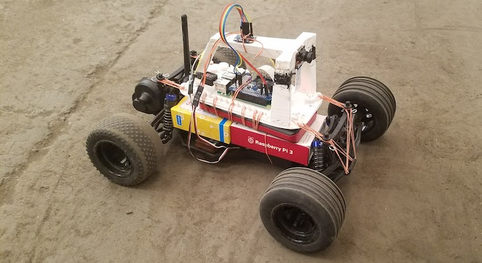

# IRONCAR



## INTRODUCTION

Ironcar is a self-driving software for RC cars. The car does drive around a racetrack and has to finish the race the fastest possible without crossing the lines.

## HARDWARE

Google doc with tutorial:  https://docs.google.com/document/d/1jyRhlbmthMA_DuuulYnzUT38okIF_KFZH0a4hh8NCg8/edit?usp=sharing .

## SETUP

### Raspberry Pi
Clone this repo on your Raspberry Pi :

```
$ git clone https://github.com/vinzeebreak/ironcar.git
$ cd ironcar
```

You can easily setup everything on the raspi using the `install.sh` bash. To do so, go on your raspi and do:
```
$ ./install.sh
```

It will install *[keras](https://github.com/keras-team/keras)*, *[tensorflow](https://www.tensorflow.org/)* and some other dependencies in the requirements. This can take 10 minutes or 1 hour... At the end of the install, you will need to choose if you want to enable the pi camera, i2c connections and augment the swap size (which is very small by default).  

### Laptop
You don't need to install anything on your laptop: you will only use your browser to connect to the raspi.

So that's it, you should be ready to go to the launching part!!


## Launching
In order to communicate between the car and the laptop or another device like a smartphone, we used *socketio* on python. Therefore, we need to launch a server on the raspi. This python server on the raspi ensures the communication with the car hardware (motors, camera and other potential sensors if you want to add any).


### On the Raspberry Pi

* To launch the server, just do:
```
$ python3 main.py
```

### On the laptop
You can access the control dashboard by visiting `http://YOUR_RASPI_IP:5000`.

### On any device
The user interface is a javascript client that can be launched in any browser (Firefox, Chrome and Safari have been tested). Just go to `YOUR_RASPI_IP:5000` and you should be able to choose the mode, the model, the speed, and control the car with a keyboard (the keyboard is obviously not supported if you connect from a smartphone !). You can also stream, take pictures and change the *commands* values of the configuration.

## Training

In order to train the car to drive itself, you need 2 things:
- images of the race
- a model

### Data

It is way too long to train the car by driving it with a remote controller. That's why we created a simulator. Nothing too fancy, it's quite easy to use. Just go [there](https://github.com/vinzeebreak/road_simulator) and follow the instructions.

### Model

The model is also given [there](https://github.com/vinzeebreak/road_simulator).
